# keephippo user guide

**keephippo** is a from-scratch, Vault-compatible secrets manager: a server that
stores secrets encrypted at rest and a command-line client (plus a browser
console) for putting secrets in and getting them out. If you have used
HashiCorp Vault or OpenBao, the commands, paths, and JSON responses will feel
familiar — keephippo speaks the same `/v1/*` HTTP API and honours the same
`VAULT_ADDR` / `VAULT_TOKEN` environment variables.

This guide teaches every CLI command and the web console, from install to daily
use. Each command is documented in three parts: a plain description you can read
top-to-bottom, then collapsible **options** and **typical use** sections for when
you need the detail.

> ⚠️ keephippo is an educational / portfolio project and has **not** been
> security-audited. Don't use it to protect real secrets yet. See
> [SECURITY.md](../SECURITY.md).

## Table of contents

- [Quick start](#quick-start)
- [Core concepts](#core-concepts)
- [Global flags](#global-flags)
- [Command reference](#command-reference)
- [Web console](#web-console)
- [See also](#see-also)

## Quick start

Build the binary and start a throwaway dev server (in-memory, auto-unsealed —
never for production):

```console
$ make build
$ ./build/keephippo server --dev
==> keephippo server (dev mode) — in-memory, auto-unsealed, TLS disabled

Unseal Key: def0a1fb…
Root Token: kh.GhO9k0O9…

export KEEPHIPPO_ADDR=http://127.0.0.1:8200
export KEEPHIPPO_TOKEN=kh.GhO9k0O9…

Web console:  http://127.0.0.1:8200/ui
Listening on http://127.0.0.1:8200
```

In another terminal, export the two variables it printed, then check status,
enable a KV engine, and write and read a secret:

```console
$ export KEEPHIPPO_ADDR=http://127.0.0.1:8200 KEEPHIPPO_TOKEN=kh.GhO9k0O9…
$ keephippo secrets enable -path=secret kv
Success! Enabled the kv secrets engine at: secret/
$ keephippo kv put secret/myapp/db username=admin password=s3cr3t
Success! Data written to: secret/myapp/db
$ keephippo kv get secret/myapp/db
Key                 Value
---                 -----
password            s3cr3t
username            admin
```

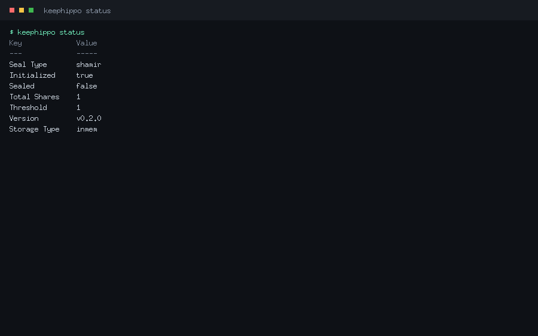

## Core concepts

- **Server vs. CLI.** The `keephippo` binary is both. `keephippo server` runs the
  long-lived process that holds your encrypted secrets; every other command is a
  thin client that talks to it over HTTP.
- **Seal / unseal.** On disk, everything is encrypted by a *barrier* key that is
  itself protected by the *root key*. A fresh server starts **sealed** (the root
  key is not in memory). You **initialize** once to generate unseal key shares and
  a root token, then **unseal** by supplying the shares. Dev mode auto-unseals.
- **Tokens.** Every request carries a token (the `X-Vault-Token` header). The
  **root token** can do anything; you create scoped tokens for day-to-day use.
- **Mounts & paths.** Secrets engines and auth methods are *mounted* at a path
  (e.g. `secret/`, `transit/`, `auth/userpass/`). A request path like
  `secret/myapp/db` routes to the engine at `secret/`.
- **Policies.** ACL policies written in HCL grant capabilities
  (`read`, `create`, `update`, `delete`, `list`, `sudo`) on path patterns. Tokens
  carry policies; the default deny means "no policy, no access".
- **Environment.** The CLI reads `KEEPHIPPO_ADDR` then `VAULT_ADDR` for the
  server address, and `KEEPHIPPO_TOKEN` then `VAULT_TOKEN` then the token stored by
  `keephippo login` (`~/.keephippo-token`) for the token.

## Global flags

These persistent flags work on every client command. keephippo accepts both the
Vault-style single dash (`-address`) and the GNU double dash (`--address`).

| Flag | Type | Default | Description |
|------|------|---------|-------------|
| `-address` | string | `http://127.0.0.1:8200` | Server address (env `KEEPHIPPO_ADDR` / `VAULT_ADDR`). |
| `-format` | `table`\|`json` | `table` | Output format; `json` matches Vault's envelope shape. |
| `-tls-skip-verify` | bool | `false` | Skip TLS certificate verification (insecure; testing only). |
| `-wrap-ttl` | duration | — | Wrap the response in a single-use token with this TTL. |

`keephippo --help` lists every command; `keephippo <command> -help` is always the
source of truth for that command's flags.

## Command reference

Commands are grouped to mirror the CLI itself. Group commands (like `kv` or
`auth`) are containers for the subcommands beneath them.

### Server & operator

#### `keephippo server`

Runs the keephippo server: the long-lived process that stores your secrets. Use
`--dev` for a throwaway in-memory server, or `--config` to point at an HCL/JSON
config file for a real, file-backed, operator-unsealed server.

<details>
<summary><strong>Command options</strong></summary>

| Flag | Type | Default | Description |
|------|------|---------|-------------|
| `--dev` | bool | `false` | In-memory, auto-unsealed dev server (prints the root token; not for production). |
| `--config` | string | — | Path to an HCL/JSON config file (required unless `--dev`). |

The config file declares a `storage` stanza (`file`/`inmem`), a `listener`, an
optional `ui = true`, and an optional `seal "transit" { … }` auto-unseal stanza.
</details>

<details>
<summary><strong>Typical use</strong></summary>

```console
$ keephippo server --config /etc/keephippo/config.hcl
==> keephippo server started (storage: file, listener: 127.0.0.1:8200)
The server is sealed. Run 'keephippo operator init', then 'keephippo operator unseal'.
```
</details>

#### `keephippo operator`

Groups the server lifecycle subcommands: `init`, `unseal`, and `seal`. You run
these against a server you administer.

<details>
<summary><strong>Command options</strong></summary>

Inherits the global flags; the work is done by the subcommands below.
</details>

<details>
<summary><strong>Typical use</strong></summary>

```console
$ keephippo operator init -key-shares=1 -key-threshold=1
$ keephippo operator unseal <unseal-key>
```
</details>

#### `keephippo operator init`

Initializes a brand-new server exactly once: it generates the barrier/root keys,
splits the root key into unseal **key shares**, and prints those shares plus the
initial **root token**. Save them somewhere safe — they are shown only once.

<details>
<summary><strong>Command options</strong></summary>

| Flag | Type | Default | Description |
|------|------|---------|-------------|
| `-key-shares` | int | `5` | Number of unseal key shares to generate. |
| `-key-threshold` | int | `3` | Number of shares required to unseal. |

</details>

<details>
<summary><strong>Typical use</strong></summary>

```console
$ keephippo operator init -key-shares=1 -key-threshold=1
Unseal Key 1: def0a1fb…
Initial Root Token: kh.GhO9k0O9…
```
</details>

#### `keephippo operator unseal`

Submits one unseal key share. Repeat with distinct shares until the threshold is
reached, at which point the server reconstructs the root key and becomes usable.

<details>
<summary><strong>Command options</strong></summary>

Takes the key share as its argument. With no argument it prompts for the key.
Inherits the global flags.
</details>

<details>
<summary><strong>Typical use</strong></summary>

```console
$ keephippo operator unseal def0a1fb…
Key                Value
---                -----
Sealed             false
```
</details>

#### `keephippo operator seal`

Re-seals a running server: it discards the in-memory root key so no secret can be
read until the server is unsealed again. Requires a root (sudo) token.

<details>
<summary><strong>Command options</strong></summary>

No flags beyond the globals.
</details>

<details>
<summary><strong>Typical use</strong></summary>

```console
$ keephippo operator seal
Success! keephippo is sealed.
```
</details>

#### `keephippo status`

Shows whether the server is initialized and sealed, the seal type and share
counts, the version, and the storage backend. It works even against a sealed
server, so it is the first thing to run when something looks wrong.


<details>
<summary><strong>Command options</strong></summary>

No flags beyond the globals. `-format=json` prints the raw seal-status envelope.
</details>

<details>
<summary><strong>Typical use</strong></summary>

```console
$ keephippo status
Key             Value
---             -----
Sealed          false
Version         v0.2.0
Storage Type    inmem
```
</details>

#### `keephippo version`

Prints the version string (a git tag like `v0.2.0`, or a commit hash for
development builds).

<details>
<summary><strong>Command options</strong></summary>

No flags.
</details>

<details>
<summary><strong>Typical use</strong></summary>

```console
$ keephippo version
v0.2.0
```
</details>

#### `keephippo info`

Prints a fuller build summary: version, branch, commit, build time, and the Go
toolchain/OS/arch. Handy in bug reports.

<details>
<summary><strong>Command options</strong></summary>

No flags.
</details>

<details>
<summary><strong>Typical use</strong></summary>

```console
$ keephippo info
version:    v0.2.0
commit:     95c84d7
```
</details>

### Session

#### `keephippo login`

Authenticates and stores the resulting token locally (`~/.keephippo-token`) so
later commands don't need `KEEPHIPPO_TOKEN`. Log in with a raw token, or with
`-method=userpass` / `-method=approle` to exchange credentials for a token.

<details>
<summary><strong>Command options</strong></summary>

| Flag | Type | Default | Description |
|------|------|---------|-------------|
| `--token` | string | — | The token to store (token method). |
| `--method` | string | — | Auth method: `userpass` or `approle`. |
| `--path` | string | method name | Mount path of the auth method. |

For `-method=userpass`, pass `username=…` and `password=…` as arguments; for
`-method=approle`, pass `role_id=…` and `secret_id=…`.
</details>

<details>
<summary><strong>Typical use</strong></summary>

```console
$ keephippo login -method=userpass username=alice password=s3cr3t
Success! You are now authenticated. The token has been stored and
will be used for future commands.
```
</details>

### Generic paths

These four verbs operate on any `/v1/*` path directly — the lowest-level way to
talk to any engine or system endpoint.

#### `keephippo read`

Reads data at a path and renders it. Equivalent to an HTTP `GET`. Add
`-format=json` to see the full response envelope.

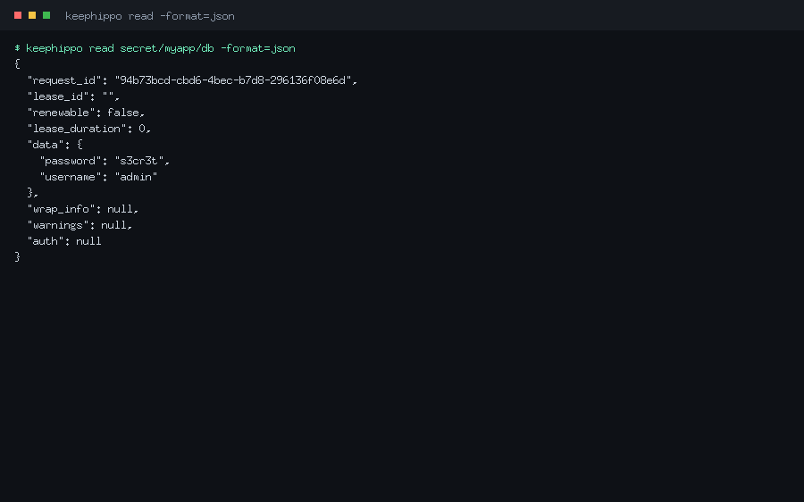

<details>
<summary><strong>Command options</strong></summary>

Global flags only. `-format=json` prints the raw envelope; `-wrap-ttl` wraps the
response into a single-use token.
</details>

<details>
<summary><strong>Typical use</strong></summary>

```console
$ keephippo read secret/data/myapp/db -format=json
{
  "data": { "password": "s3cr3t", "username": "admin" },
  "lease_duration": 0,
  "renewable": false
}
```
</details>

#### `keephippo write`

Writes `key=value` pairs (or a config change) to a path. Equivalent to an HTTP
`PUT`/`POST`. Use `-` as a value source to read a value from stdin.

<details>
<summary><strong>Command options</strong></summary>

Takes `PATH [KEY=VALUE...]`. Global flags apply.
</details>

<details>
<summary><strong>Typical use</strong></summary>

```console
$ keephippo write auth/approle/role/ci token_policies=deploy
Success! Data written to: auth/approle/role/ci
```
</details>

#### `keephippo list`

Lists the child keys under a path (an HTTP `LIST`). Trailing-slash entries are
sub-paths you can list further.

<details>
<summary><strong>Command options</strong></summary>

Global flags only. Returns exit code 2 with "No value found" when empty.
</details>

<details>
<summary><strong>Typical use</strong></summary>

```console
$ keephippo list secret/metadata/myapp
Keys
----
db
```
</details>

#### `keephippo delete`

Deletes the data at a path (an HTTP `DELETE`).

<details>
<summary><strong>Command options</strong></summary>

Global flags only.
</details>

<details>
<summary><strong>Typical use</strong></summary>

```console
$ keephippo delete secret/data/myapp/db
Success! Data deleted (if it existed) at: secret/data/myapp/db
```
</details>

### KV

The `kv` command is a convenience wrapper over the KV secrets engine. It detects
whether a mount is **v1** (unversioned) or **v2** (versioned) and rewrites paths
onto the `data/` and `metadata/` sub-paths automatically.

#### `keephippo kv`

Groups the KV subcommands: `put`, `get`, `list`, `delete`, plus the v2 verbs
`undelete`, `destroy`, `patch`, `rollback`, and `metadata`.

<details>
<summary><strong>Command options</strong></summary>

Inherits the global flags; behaviour lives in the subcommands.
</details>

<details>
<summary><strong>Typical use</strong></summary>

```console
$ keephippo kv put secret/hello greeting=world
$ keephippo kv get secret/hello
```
</details>

#### `keephippo kv put`

Writes one or more `key=value` pairs to a KV path — the everyday "save this
secret here" command. On a v2 mount it creates a new version.

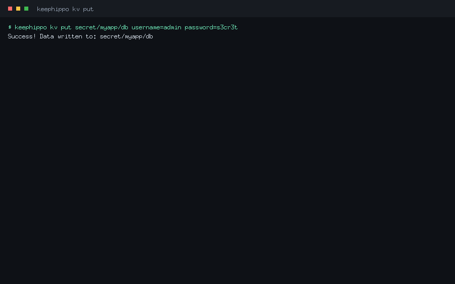

<details>
<summary><strong>Command options</strong></summary>

| Flag | Type | Default | Description |
|------|------|---------|-------------|
| `-cas` | int | — | Check-and-set: only write if the current version matches (KV v2). |

</details>

<details>
<summary><strong>Typical use</strong></summary>

```console
$ keephippo kv put secret/myapp/db username=admin password=s3cr3t
Success! Data written to: secret/myapp/db
```
</details>

#### `keephippo kv get`

Reads a secret and prints its fields. On a v2 mount, `-version` reads a specific
historical version and the metadata (version, timestamps) is shown alongside.

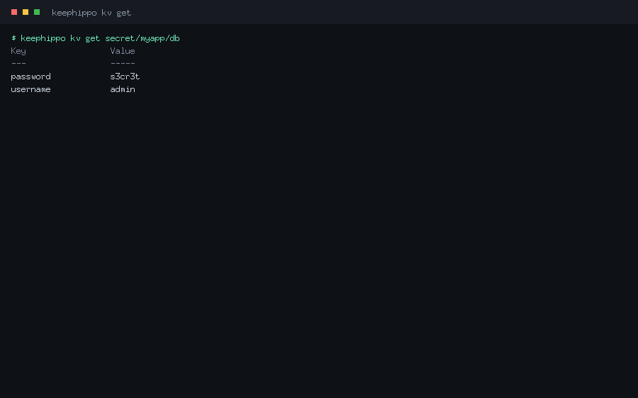

<details>
<summary><strong>Command options</strong></summary>

| Flag | Type | Default | Description |
|------|------|---------|-------------|
| `-version` | int | latest | Read a specific version (KV v2). |

</details>

<details>
<summary><strong>Typical use</strong></summary>

```console
$ keephippo kv get secret/myapp/db
Key                 Value
---                 -----
password            s3cr3t
username            admin
```
</details>

#### `keephippo kv list`

Lists the keys under a KV path (uses the `metadata/` layout on v2 mounts).

<details>
<summary><strong>Command options</strong></summary>

Global flags only.
</details>

<details>
<summary><strong>Typical use</strong></summary>

```console
$ keephippo kv list secret/myapp
Keys
----
db
```
</details>

#### `keephippo kv delete`

Deletes a secret. On a v2 mount this is a **soft delete** (the version can be
undeleted); pass `-versions` to soft-delete specific versions.

<details>
<summary><strong>Command options</strong></summary>

| Flag | Type | Default | Description |
|------|------|---------|-------------|
| `-versions` | list | latest | Comma-separated versions to soft-delete (KV v2). |

</details>

<details>
<summary><strong>Typical use</strong></summary>

```console
$ keephippo kv delete -versions=2 secret/myapp/db
Success! Data deleted (if it existed) at: secret/myapp/db
```
</details>

#### `keephippo kv undelete`

Restores soft-deleted versions of a v2 secret.

<details>
<summary><strong>Command options</strong></summary>

| Flag | Type | Default | Description |
|------|------|---------|-------------|
| `-versions` | list | — | Comma-separated versions to restore (required). |

</details>

<details>
<summary><strong>Typical use</strong></summary>

```console
$ keephippo kv undelete -versions=2 secret/myapp/db
```
</details>

#### `keephippo kv destroy`

Permanently destroys specific versions of a v2 secret — the data is gone and
cannot be undeleted.

<details>
<summary><strong>Command options</strong></summary>

| Flag | Type | Default | Description |
|------|------|---------|-------------|
| `-versions` | list | — | Comma-separated versions to destroy (required). |

</details>

<details>
<summary><strong>Typical use</strong></summary>

```console
$ keephippo kv destroy -versions=1 secret/myapp/db
```
</details>

#### `keephippo kv patch`

Updates individual fields of the latest v2 version without replacing the whole
secret (a read-modify-write that keeps the other keys).

<details>
<summary><strong>Command options</strong></summary>

Takes `PATH KEY=VALUE...`. KV v2 only.
</details>

<details>
<summary><strong>Typical use</strong></summary>

```console
$ keephippo kv patch secret/myapp/db password=rotated
```
</details>

#### `keephippo kv rollback`

Restores an older version as a new latest version (the contents of version N are
written back as version N+1).

<details>
<summary><strong>Command options</strong></summary>

| Flag | Type | Default | Description |
|------|------|---------|-------------|
| `-version` | int | — | The version to roll back to (required). |

</details>

<details>
<summary><strong>Typical use</strong></summary>

```console
$ keephippo kv rollback -version=1 secret/myapp/db
```
</details>

#### `keephippo kv metadata`

Groups the v2 metadata subcommands (`get`, `put`, `delete`) for a key's version
history and tunables.

<details>
<summary><strong>Command options</strong></summary>

Inherits the global flags.
</details>

<details>
<summary><strong>Typical use</strong></summary>

```console
$ keephippo kv metadata get secret/myapp/db
```
</details>

#### `keephippo kv metadata get`

Reads a key's metadata: current version, version history, `max_versions`, and
`cas_required`.

<details>
<summary><strong>Command options</strong></summary>

Global flags only.
</details>

<details>
<summary><strong>Typical use</strong></summary>

```console
$ keephippo kv metadata get secret/myapp/db
Key                 Value
---                 -----
current_version     2
max_versions        0
```
</details>

#### `keephippo kv metadata put`

Configures a key's metadata: the number of versions to keep and whether writes
must use check-and-set.

<details>
<summary><strong>Command options</strong></summary>

| Flag | Type | Default | Description |
|------|------|---------|-------------|
| `-max-versions` | int | — | Number of versions to keep. |
| `-cas-required` | bool | `false` | Require check-and-set on writes. |

</details>

<details>
<summary><strong>Typical use</strong></summary>

```console
$ keephippo kv metadata put -max-versions=5 secret/myapp/db
```
</details>

#### `keephippo kv metadata delete`

Deletes a key and **all** of its versions and metadata (a hard delete of the
whole key).

<details>
<summary><strong>Command options</strong></summary>

Global flags only.
</details>

<details>
<summary><strong>Typical use</strong></summary>

```console
$ keephippo kv metadata delete secret/myapp/db
```
</details>

### Engines & tuning

#### `keephippo secrets`

Groups the secrets-engine management subcommands: `enable`, `disable`, `list`,
`move`, and `tune`.

<details>
<summary><strong>Command options</strong></summary>

Inherits the global flags.
</details>

<details>
<summary><strong>Typical use</strong></summary>

```console
$ keephippo secrets list
```
</details>

#### `keephippo secrets enable`

Mounts a secrets engine at a path. Supported types: `kv`, `transit`, `totp`. Use
`-version=2` to enable versioned KV.

<details>
<summary><strong>Command options</strong></summary>

| Flag | Type | Default | Description |
|------|------|---------|-------------|
| `-path` | string | type name | Path to mount the engine at. |
| `-version` | int | `1` | KV engine version (`2` for versioned KV). |

</details>

<details>
<summary><strong>Typical use</strong></summary>

```console
$ keephippo secrets enable -path=secret -version=2 kv
Success! Enabled the kv secrets engine at: secret/
```
</details>

#### `keephippo secrets disable`

Unmounts a secrets engine and clears its data.

<details>
<summary><strong>Command options</strong></summary>

Global flags only.
</details>

<details>
<summary><strong>Typical use</strong></summary>

```console
$ keephippo secrets disable secret
Success! Disabled the secrets engine (if it existed) at: secret/
```
</details>

#### `keephippo secrets list`

Lists the enabled secrets engines and their types.

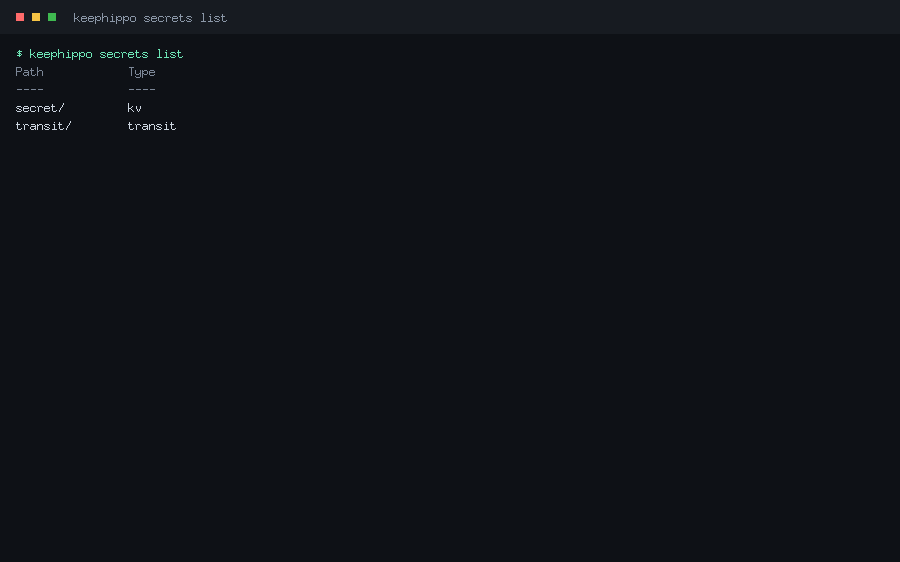

<details>
<summary><strong>Command options</strong></summary>

Global flags only.
</details>

<details>
<summary><strong>Typical use</strong></summary>

```console
$ keephippo secrets list
Path            Type
----            ----
secret/         kv
transit/        transit
```
</details>

#### `keephippo secrets move`

Moves a secrets engine to a new mount path, preserving its data (which is keyed
by the mount's UUID, not its path).

<details>
<summary><strong>Command options</strong></summary>

Takes `SOURCE DEST`. Global flags apply.
</details>

<details>
<summary><strong>Typical use</strong></summary>

```console
$ keephippo secrets move secret kv
Success! Moved secrets engine secret/ to: kv/
```
</details>

#### `keephippo secrets tune`

Reads or updates a mount's tunable configuration (e.g. description, KV options).

<details>
<summary><strong>Command options</strong></summary>

Takes `PATH [KEY=VALUE...]`; with no pairs it reads the current config.
</details>

<details>
<summary><strong>Typical use</strong></summary>

```console
$ keephippo secrets tune secret
```
</details>

### Auth

#### `keephippo auth`

Groups the auth-method management subcommands: `enable`, `disable`, `list`. keephippo
ships `token` (built-in), `userpass`, `approle`, and `cert`.

<details>
<summary><strong>Command options</strong></summary>

Inherits the global flags.
</details>

<details>
<summary><strong>Typical use</strong></summary>

```console
$ keephippo auth list
```
</details>

#### `keephippo auth enable`

Mounts an auth method under `auth/`. After enabling, configure users/roles/certs
with `keephippo write auth/<path>/…`.

<details>
<summary><strong>Command options</strong></summary>

| Flag | Type | Default | Description |
|------|------|---------|-------------|
| `-path` | string | type name | Path to mount the auth method at. |

</details>

<details>
<summary><strong>Typical use</strong></summary>

```console
$ keephippo auth enable userpass
Success! Enabled userpass auth method at: userpass/
$ keephippo write auth/userpass/users/alice password=s3cr3t token_policies=app
```
</details>

#### `keephippo auth disable`

Disables an auth method and clears its data.

<details>
<summary><strong>Command options</strong></summary>

Global flags only.
</details>

<details>
<summary><strong>Typical use</strong></summary>

```console
$ keephippo auth disable userpass
```
</details>

#### `keephippo auth list`

Lists the enabled auth methods (always including the built-in `token/`).

<details>
<summary><strong>Command options</strong></summary>

Global flags only.
</details>

<details>
<summary><strong>Typical use</strong></summary>

```console
$ keephippo auth list
Path            Type
----            ----
token/          token
userpass/       userpass
```
</details>

### Policies

#### `keephippo policy`

Groups the ACL policy subcommands: `read`, `write`, `list`, `delete`. Policies
are HCL that grant capabilities on path patterns.

<details>
<summary><strong>Command options</strong></summary>

Inherits the global flags.
</details>

<details>
<summary><strong>Typical use</strong></summary>

```console
$ keephippo policy list
```
</details>

#### `keephippo policy write`

Creates or updates a named policy from an HCL file, an inline string, or stdin
(`-`).

<details>
<summary><strong>Command options</strong></summary>

Takes `NAME PATH-OR-"-"`. Reading from `-` consumes the policy HCL from stdin.
</details>

<details>
<summary><strong>Typical use</strong></summary>

```console
$ keephippo policy write app - <<'EOF'
path "secret/data/myapp/*" {
  capabilities = ["read", "list"]
}
EOF
Success! Uploaded policy: app
```
</details>

#### `keephippo policy read`

Prints a policy's HCL source.

<details>
<summary><strong>Command options</strong></summary>

Global flags only.
</details>

<details>
<summary><strong>Typical use</strong></summary>

```console
$ keephippo policy read app
path "secret/data/myapp/*" {
  capabilities = ["read", "list"]
}
```
</details>

#### `keephippo policy list`

Lists the policy names (always including `root` and `default`).

<details>
<summary><strong>Command options</strong></summary>

Global flags only.
</details>

<details>
<summary><strong>Typical use</strong></summary>

```console
$ keephippo policy list
Keys
----
app
default
root
```
</details>

#### `keephippo policy delete`

Deletes a policy. The built-in `root` and `default` policies cannot be deleted.

<details>
<summary><strong>Command options</strong></summary>

Global flags only.
</details>

<details>
<summary><strong>Typical use</strong></summary>

```console
$ keephippo policy delete app
Success! Deleted policy: app
```
</details>

### Tokens

#### `keephippo token`

Groups the token subcommands: `create`, `lookup`, `renew`, `revoke`, and
`capabilities`.

<details>
<summary><strong>Command options</strong></summary>

Inherits the global flags.
</details>

<details>
<summary><strong>Typical use</strong></summary>

```console
$ keephippo token create -policy=app -ttl=1h
```
</details>

#### `keephippo token create`

Mints a new token with a set of policies and a TTL. The parent token must be
allowed to grant what it hands out (only a root token can create root tokens).

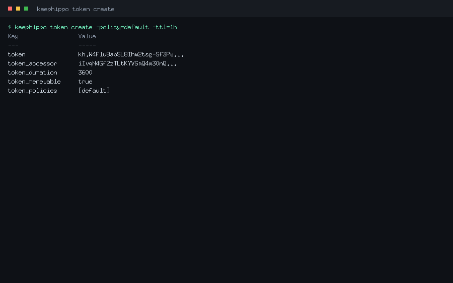

<details>
<summary><strong>Command options</strong></summary>

| Flag | Type | Default | Description |
|------|------|---------|-------------|
| `-policy` | list | — | Policy to attach (repeatable). |
| `-ttl` | duration | system default | Token lifetime. |
| `-num-uses` | int | unlimited | Limit the token to this many uses. |
| `-display-name` | string | — | A human label recorded on the token. |
| `-no-default-policy` | bool | `false` | Don't attach the `default` policy. |

</details>

<details>
<summary><strong>Typical use</strong></summary>

```console
$ keephippo token create -policy=app -ttl=1h
Key                 Value
---                 -----
token               kh.W4Flu8ab…
token_policies      [default app]
```
</details>

#### `keephippo token lookup`

Shows a token's metadata: its policies, remaining TTL, accessor, and (if any)
its identity entity.

<details>
<summary><strong>Command options</strong></summary>

Takes an optional token argument; with none it looks up your own token.
</details>

<details>
<summary><strong>Typical use</strong></summary>

```console
$ keephippo token lookup
Key                 Value
---                 -----
policies            [root]
ttl                 0
```
</details>

#### `keephippo token renew`

Extends a renewable token's TTL, up to its maximum.

<details>
<summary><strong>Command options</strong></summary>

Takes the token and an optional `-increment`. Global flags apply.
</details>

<details>
<summary><strong>Typical use</strong></summary>

```console
$ keephippo token renew -increment=1h kh.W4Flu8ab…
```
</details>

#### `keephippo token revoke`

Revokes a token immediately, destroying it and its cubbyhole.

<details>
<summary><strong>Command options</strong></summary>

Takes the token to revoke. Global flags apply.
</details>

<details>
<summary><strong>Typical use</strong></summary>

```console
$ keephippo token revoke kh.W4Flu8ab…
Success! Revoked token
```
</details>

#### `keephippo token capabilities`

Reports which capabilities a token has on a given path — the quick way to answer
"can this token read that secret?".

<details>
<summary><strong>Command options</strong></summary>

Takes `[TOKEN] PATH`; with only a path it checks your own token.
</details>

<details>
<summary><strong>Typical use</strong></summary>

```console
$ keephippo token capabilities secret/data/myapp/db
read, list
```
</details>

### Leases

#### `keephippo lease`

Groups the lease subcommands: `lookup`, `renew`, `revoke`. Leases back tokens
(and, in future, dynamic secrets); the server auto-revokes them on expiry.

<details>
<summary><strong>Command options</strong></summary>

Inherits the global flags.
</details>

<details>
<summary><strong>Typical use</strong></summary>

```console
$ keephippo lease lookup auth/token/create/<id>
```
</details>

#### `keephippo lease lookup`

Shows a lease's metadata: issue time, expiry, and remaining TTL.

<details>
<summary><strong>Command options</strong></summary>

Takes the lease ID. Global flags apply.
</details>

<details>
<summary><strong>Typical use</strong></summary>

```console
$ keephippo lease lookup auth/token/create/abc123
Key                 Value
---                 -----
ttl                 3540
renewable           true
```
</details>

#### `keephippo lease renew`

Extends a lease (and the token behind it), capped by its maximum TTL.

<details>
<summary><strong>Command options</strong></summary>

| Flag | Type | Default | Description |
|------|------|---------|-------------|
| `-increment` | duration | — | Requested extension (e.g. `1h`). |

</details>

<details>
<summary><strong>Typical use</strong></summary>

```console
$ keephippo lease renew -increment=1h auth/token/create/abc123
```
</details>

#### `keephippo lease revoke`

Revokes a lease now. With `-prefix`, revokes every lease under a prefix at once
(a sudo operation).

<details>
<summary><strong>Command options</strong></summary>

| Flag | Type | Default | Description |
|------|------|---------|-------------|
| `-prefix` | bool | `false` | Treat the argument as a prefix and revoke all matches. |

</details>

<details>
<summary><strong>Typical use</strong></summary>

```console
$ keephippo lease revoke -prefix auth/token/create/
Success! Revoked all leases under prefix: auth/token/create/
```
</details>

### Transit

The `transit` command is a thin convenience wrapper over the transit engine
(encryption-as-a-service); it base64-encodes plaintext for you. You can also
drive transit with the generic `write`/`read` commands.

#### `keephippo transit`

Groups the transit subcommands: `key`, `encrypt`, `decrypt`, `rewrap`.

<details>
<summary><strong>Command options</strong></summary>

| Flag | Type | Default | Description |
|------|------|---------|-------------|
| `--mount` | string | `transit` | Transit mount path. |

</details>

<details>
<summary><strong>Typical use</strong></summary>

```console
$ keephippo transit key create app
$ keephippo transit encrypt app "launch codes"
```
</details>

#### `keephippo transit key`

Groups the key-management subcommands: `create`, `read`, `rotate`.

<details>
<summary><strong>Command options</strong></summary>

Inherits `--mount`.
</details>

<details>
<summary><strong>Typical use</strong></summary>

```console
$ keephippo transit key read app
```
</details>

#### `keephippo transit key create`

Creates a named encryption key. The default type is `aes256-gcm96`; other types
are `chacha20-poly1305` (encryption) and `ed25519` / `ecdsa-p256` (signing).

<details>
<summary><strong>Command options</strong></summary>

| Flag | Type | Default | Description |
|------|------|---------|-------------|
| `-type` | string | `aes256-gcm96` | Key type. |

</details>

<details>
<summary><strong>Typical use</strong></summary>

```console
$ keephippo transit key create app
```
</details>

#### `keephippo transit key read`

Reads a key's metadata: type, latest version, and (for signing keys) the public
keys. The secret key material never leaves the server.

<details>
<summary><strong>Command options</strong></summary>

Inherits `--mount`.
</details>

<details>
<summary><strong>Typical use</strong></summary>

```console
$ keephippo transit key read app
Key                 Value
---                 -----
type                aes256-gcm96
latest_version      1
```
</details>

#### `keephippo transit key rotate`

Adds a new version to a key. New encryptions use the new version; old ciphertext
still decrypts until you raise `min_decryption_version`.

<details>
<summary><strong>Command options</strong></summary>

Inherits `--mount`.
</details>

<details>
<summary><strong>Typical use</strong></summary>

```console
$ keephippo transit key rotate app
```
</details>

#### `keephippo transit encrypt`

Encrypts plaintext with a named key and prints the versioned ciphertext
(`vault:v1:…`). The CLI base64-encodes the plaintext for you.

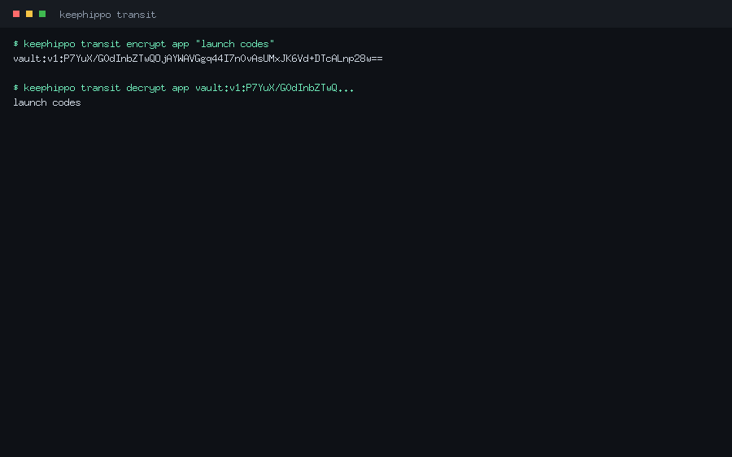

<details>
<summary><strong>Command options</strong></summary>

Takes `NAME PLAINTEXT`. Inherits `--mount`.
</details>

<details>
<summary><strong>Typical use</strong></summary>

```console
$ keephippo transit encrypt app "launch codes"
vault:v1:P7YuX/G0dInbZTwQOjAYWAVGgq44…
```
</details>

#### `keephippo transit decrypt`

Decrypts a `vault:v…` ciphertext with a named key and prints the recovered
plaintext.

<details>
<summary><strong>Command options</strong></summary>

Takes `NAME CIPHERTEXT`. Inherits `--mount`.
</details>

<details>
<summary><strong>Typical use</strong></summary>

```console
$ keephippo transit decrypt app vault:v1:P7YuX/G0dInbZTwQ…
launch codes
```
</details>

#### `keephippo transit rewrap`

Re-encrypts a ciphertext with the key's latest version — how you upgrade old
ciphertext after a key rotation without ever seeing the plaintext.

<details>
<summary><strong>Command options</strong></summary>

Takes `NAME CIPHERTEXT`. Inherits `--mount`.
</details>

<details>
<summary><strong>Typical use</strong></summary>

```console
$ keephippo transit rewrap app vault:v1:P7YuX/G0dInbZTwQ…
vault:v2:9aRk2…
```
</details>

### Audit & wrapping

#### `keephippo audit`

Groups the audit-device subcommands: `enable`, `disable`, `list`. Audit devices
record every request with sensitive fields HMAC-obscured, and are fail-closed.

<details>
<summary><strong>Command options</strong></summary>

Inherits the global flags.
</details>

<details>
<summary><strong>Typical use</strong></summary>

```console
$ keephippo audit list
```
</details>

#### `keephippo audit enable`

Enables an audit device. The `file` device appends JSON lines to a path; the
`syslog` device writes to the local syslog. Pass device options as `key=value`.

<details>
<summary><strong>Command options</strong></summary>

| Flag | Type | Default | Description |
|------|------|---------|-------------|
| `-path` | string | type name | Path for the audit device. |

Extra `key=value` arguments become device options (e.g. `file_path=…`).
</details>

<details>
<summary><strong>Typical use</strong></summary>

```console
$ keephippo audit enable file file_path=/var/log/keephippo/audit.log
Success! Enabled the file audit device at: file/
```
</details>

#### `keephippo audit disable`

Disables an audit device.

<details>
<summary><strong>Command options</strong></summary>

Global flags only.
</details>

<details>
<summary><strong>Typical use</strong></summary>

```console
$ keephippo audit disable file
```
</details>

#### `keephippo audit list`

Lists the enabled audit devices and their options.

<details>
<summary><strong>Command options</strong></summary>

Global flags only.
</details>

<details>
<summary><strong>Typical use</strong></summary>

```console
$ keephippo audit list
Path            Type
----            ----
file/           file
```
</details>

#### `keephippo unwrap`

Unwraps a response-wrapping token, returning the original data. Response wrapping
(request a wrap with the global `-wrap-ttl` flag) hides a secret behind a
single-use token; `unwrap` reveals it **exactly once**.

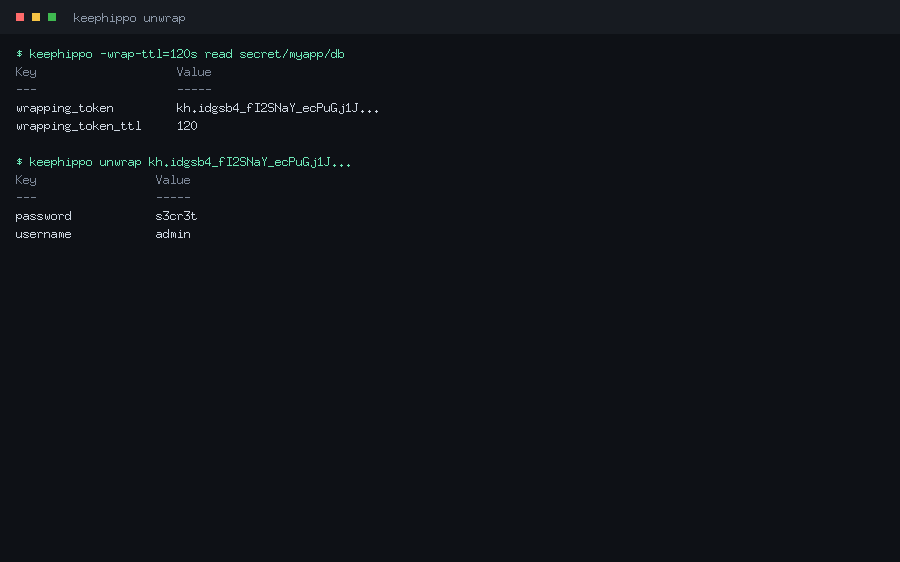

<details>
<summary><strong>Command options</strong></summary>

Takes an optional wrapping-token argument; with none, the stored/authenticated
token is treated as the wrapping token.
</details>

<details>
<summary><strong>Typical use</strong></summary>

```console
$ keephippo -wrap-ttl=120s read secret/myapp/db
Key                    Value
---                    -----
wrapping_token         kh.idgsb4_fI2SNaY…
wrapping_token_ttl     120
$ keephippo unwrap kh.idgsb4_fI2SNaY…
Key                 Value
---                 -----
password            s3cr3t
username            admin
```
</details>

## Web console

Enable the browser console with `ui = true` in your config (dev mode enables it
automatically), then open `http://127.0.0.1:8200/ui`. It is just another client
of the `/v1/*` API — it grants no extra privileges — and works entirely with the
token you sign in with. This walkthrough follows the same login → unseal → enable
mount → write/read → edit policy → run a console command path as the CLI.

**1. Sign in.** The login screen offers token, userpass, and approle. If the
server is sealed it shows an unseal box first; submit key shares until it opens.

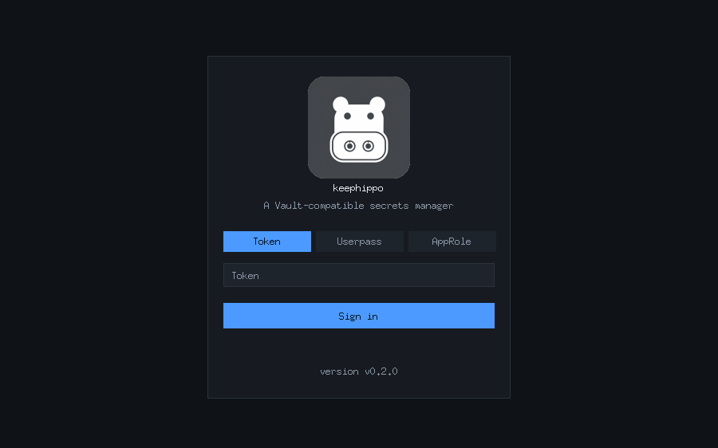

**2. Browse and enable engines.** The **Secrets** screen lists your mounts and
lets you enable a new one (pick a type and, for KV, a version), then read and
write secrets from a simple form.

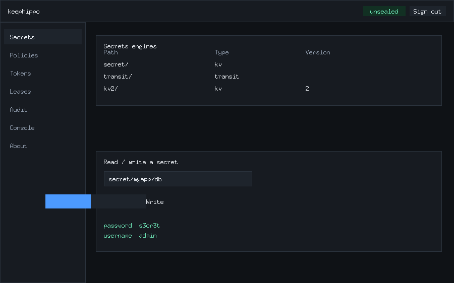

**3. View and edit policies.** The **Policies** screen loads any policy into an
editor and saves your changes back — the browser equivalent of
`keephippo policy read` / `policy write`.

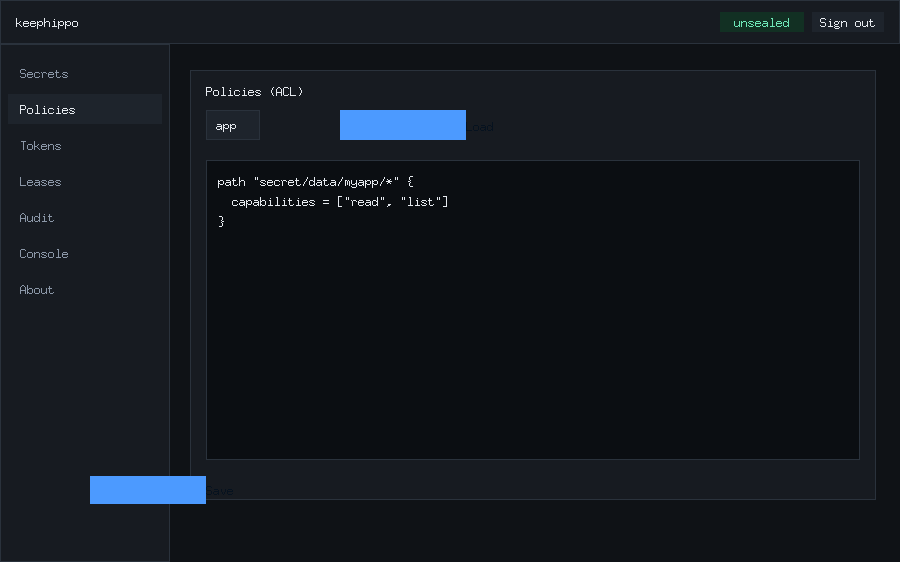

**4. Run commands interactively.** The **Console** screen is an in-browser REPL:
type `write secret/x a=b` then `read secret/x` and it renders the same JSON
envelope the CLI returns, executing against `/v1/*` with your token.

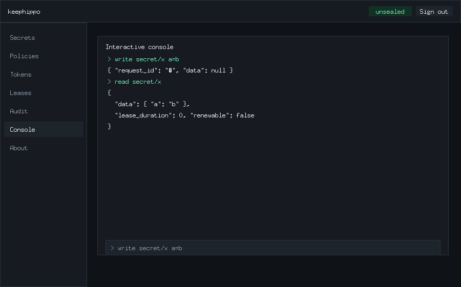

**5. About.** The **About** panel shows the app badge, name, and version (read
live from `sys/seal-status`). Token and lease management live under the **Tokens**
and **Leases** screens, and enabled audit devices under **Audit**.

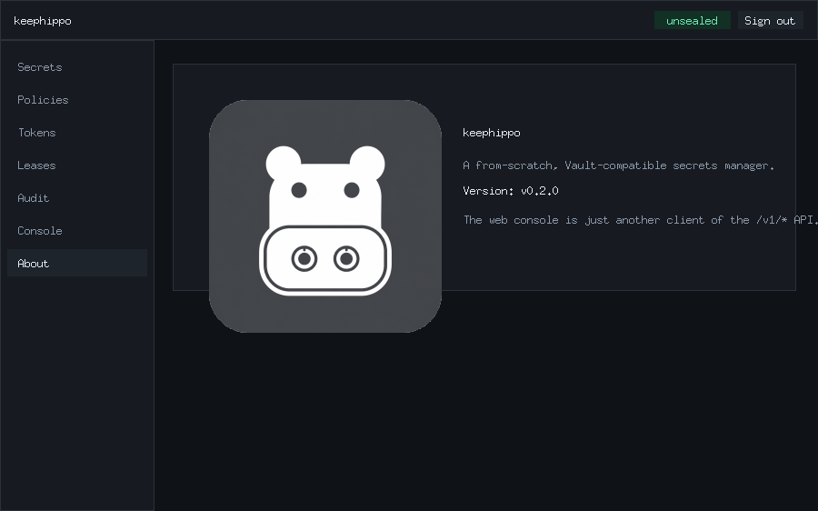

## See also

- [`README.md`](../README.md) — project overview and quick start.
- [`API_COMPAT.md`](API_COMPAT.md) — the Vault-compatible endpoint scoreboard.
- [`ARCHITECTURE.md`](ARCHITECTURE.md) — how the server is built, layer by layer.
